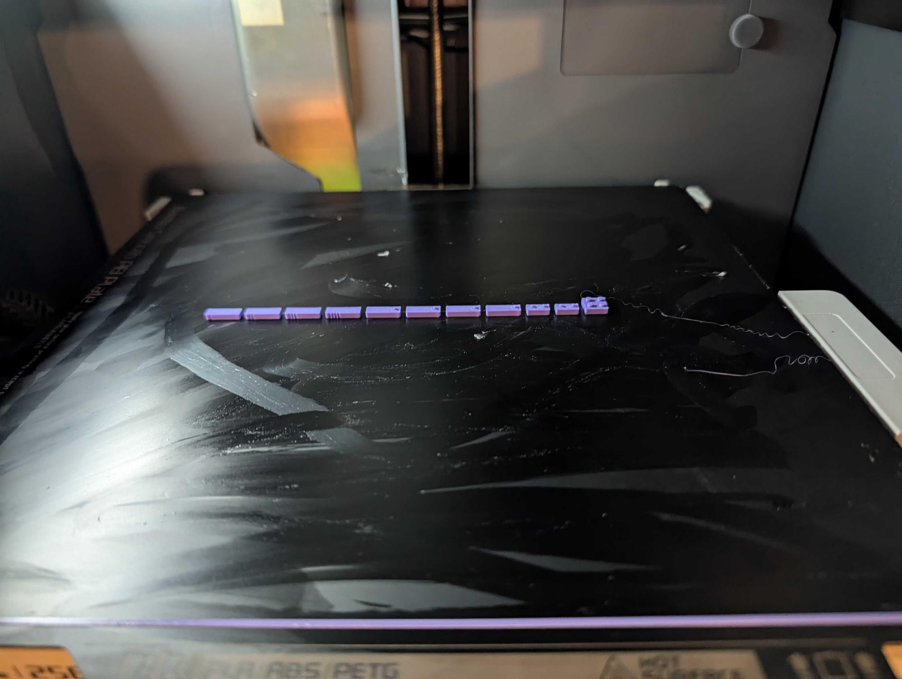
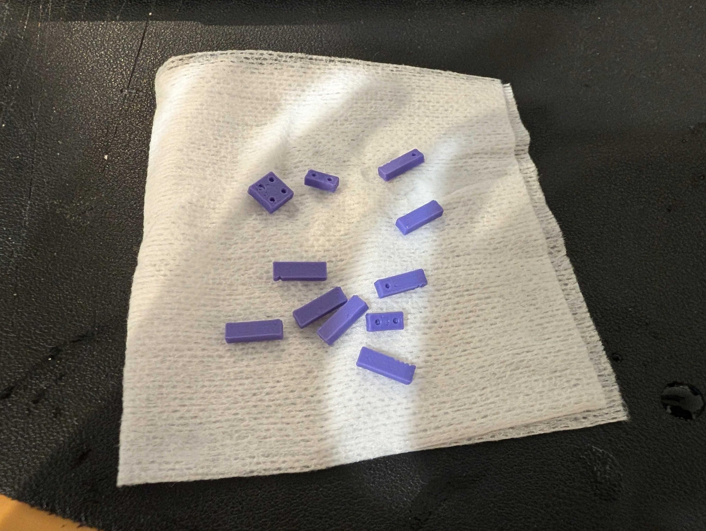
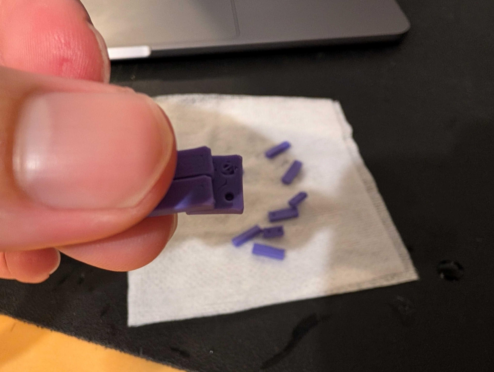
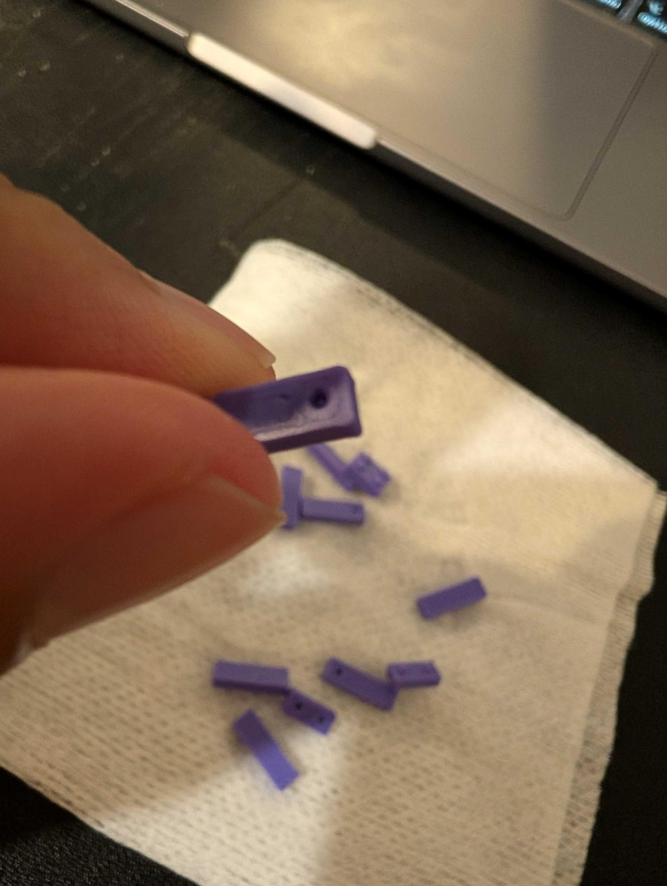
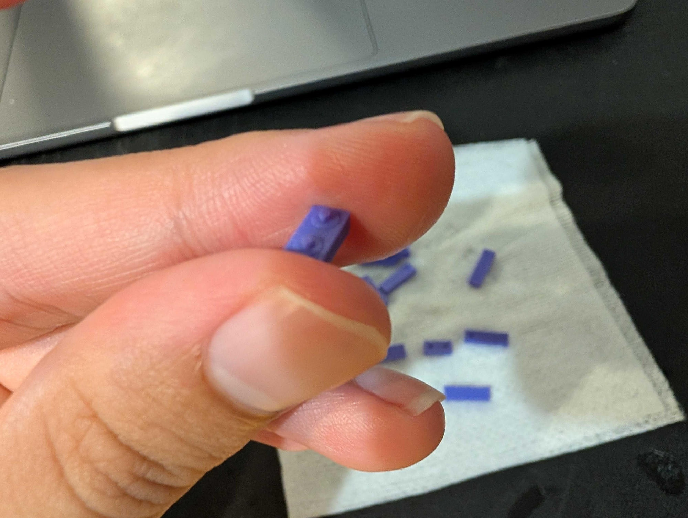
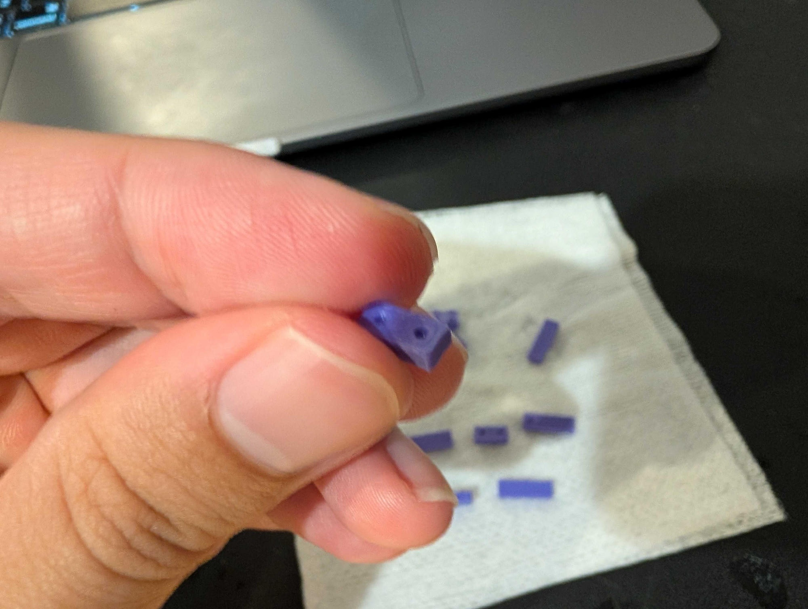
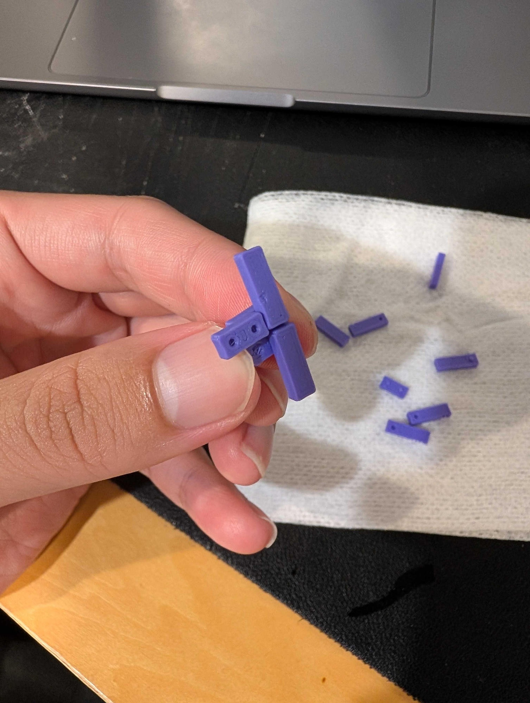
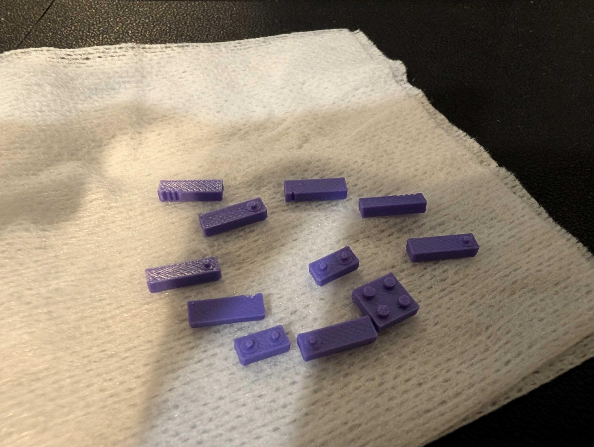
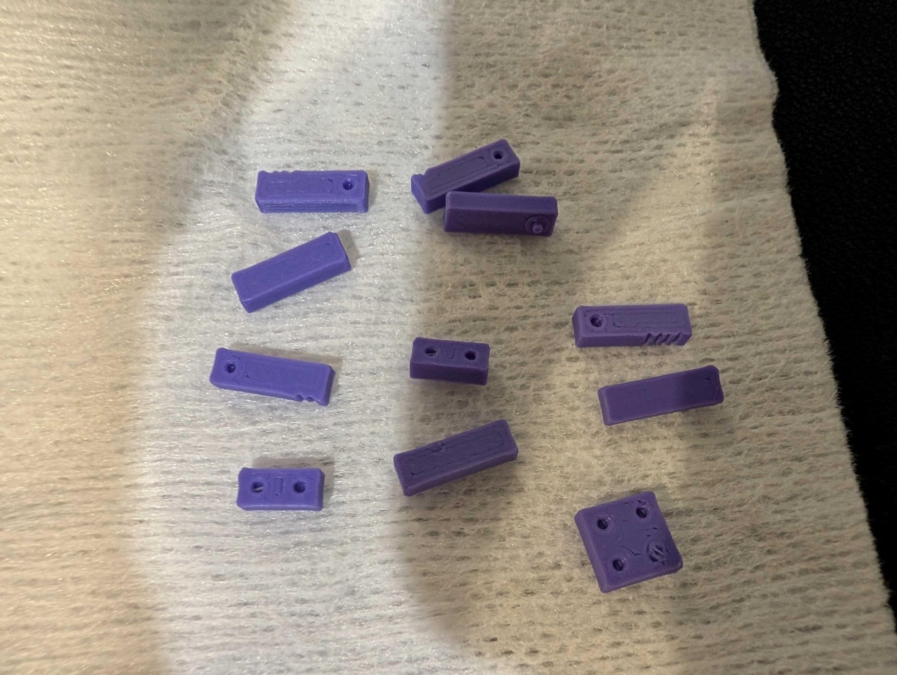
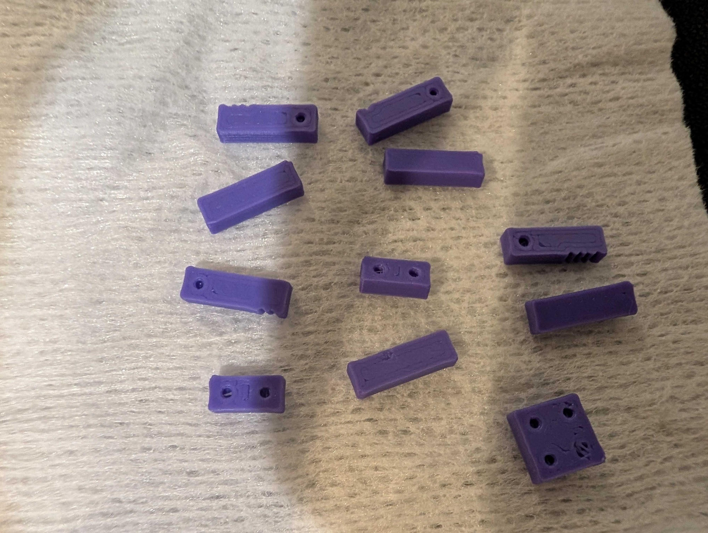

# 2026-09-19: 4 mm接合部の初回実物フィードバック

> **履歴の位置づけ（2026-09-20追記）**：この写真・動画・報告は旧r2・4 mm試作の記録です。
> 8 mm共通ブロックへの設計改訂の実装は、その後に承認されました。新版の実物試験結果ではありません。
> 新版の公開状態は [版別公開記録](../../archive/revisions.json) と [設計ガイド](../../docs/COMMON-BLOCKS.ja.md) で確認してください。

[日本語](README.md) / [English](README.en.md) ·
[アーカイブの案内](../../README.md) ·
[公開ページ](https://ktanino10.github.io/octoprints-brick-kit-downloads/ja/feedback.html)

**結果: 現行の小型接合部は、そのまま全体模型へ展開しません。改良方針を検討中です。**

全数印刷は保留中で、配布形状はすべて **NOT_SLICED** です。実物試験が行われなかった、という意味ではありません。

この記録は、提供者の公開許可を得て掲載しています。
成功例や製造承認ではなく、実際の使いにくさを次の設計に反映するための記録です。

## 提供者からの報告

> 小さくて作りにくいですね。そして、穴がプラスチックで埋まっていたり、します

次の二つを別の課題として扱います。

| 課題 | 現時点で言えること | まだ言えないこと |
|---|---|---|
| 部品が小さく扱いにくい | 提供者による実使用の報告。細かい分割数だけを増やす方針を見直す | より大きい部品の最適寸法、必要な組立時間 |
| 一部の穴が樹脂で埋まる | 提供者による成形結果の報告。追加確認で、超音波洗浄前から発生していたと回答 | 初層、サポート、スライサー設定、形状などのどれが主因か |

印刷された部品が存在することと、嵌合・保持力・耐久性が合格することは別です。
各ノッチ条件の着座、保持力、繰り返し着脱後の状態は、数値や条件別の結果としてまだ確定していません。
無理な押し込みや、小穴を一つずつ削る作業を完成キットの前提にはしません。

## 対象データと未確認の条件

- 配布した試験片: 4 mm用、7種類・11部品。
- 配布3MFのSHA-256: `ce054bdae89885e9dfc0fe8dfdf5871f1b573ba1fdc25f09f24fe503ee11c69f`
- 配布STLのSHA-256: `76fbc0193ab8956fa484dd2d36585993daf1375f5e528bfc080f40849fbbdadb`
- 事前の使用条件: Bambu Lab P1S、0.2 mmノズル装着との申告。材料はPLAを想定。
- 実際に使ったスライサーのプロジェクト、プロファイル、層高、材料の銘柄、サポート設定などは未提供。
- 実際にスライスした入力のハッシュは照合していません。
- 配布物は依然として **NOT_SLICED**。スライス済み、実物嵌合合格、全体組立合格とは表示しません。

## 印刷後の超音波洗浄

[3Dプリント後の超音波洗浄（提供者のYouTube動画）](https://youtu.be/rHhXFxvFU-E)

提供者が、3Dプリント後に行った超音波洗浄のショート動画として共有したリンクです。
印刷工程の映像や、嵌合合格の証拠としては扱いません。

穴の樹脂詰まりについては、提供者から **「洗浄前から埋まっていた」** と追加回答がありました。
したがって、報告された最初の穴詰まりを超音波洗浄で生じたものとは扱いません。
印刷時点の形状・スライス結果・成形状態を調べる課題として残します。
洗浄後に詰まりが変化したか、洗浄液・温度・時間などの条件はまだ記録していません。

## 写真

写真10枚（JPEG）は向きを補正して再保存し、EXIF等のメタデータを除去しています。
番号は本記録での参照用であり、ノッチ番号や試験条件を意味しません。

| 写真 | 写真 |
|---|---|
|  |  |
|  |  |
|  |  |
|  |  |
|  |  |

## 動画

**[1本にまとめた動画: 約33.35秒・無音版](https://raw.githubusercontent.com/ktanino10/octoprints-brick-kit-downloads/main/feedback/2026-09-19/media/trial-feedback-combined.mp4)**

提供者の訂正に合わせ、**動画01 → 動画02** の順番で結合しました。
正確な長さは **33.352167秒**、**1280×720**、全**1,001フレーム**です。
再圧縮はしていません。元の2本のメタデータ除去済み・無音MP4も比較・参照用に残しています。
結合版のSHA-256: `e44c57632d5c7760d6e4618a61eb008257f1f1dc4bee8a12cb3831cd7e9092e6`

- [動画01: 約27.46秒・無音版](https://raw.githubusercontent.com/ktanino10/octoprints-brick-kit-downloads/main/feedback/2026-09-19/media/video-01-silent.mp4)
- [動画02: 約5.89秒・無音版](https://raw.githubusercontent.com/ktanino10/octoprints-brick-kit-downloads/main/feedback/2026-09-19/media/video-02-silent.mp4)

公開用動画は映像を再圧縮せず、音声、センサーデータのトラック、位置情報・撮影日時などの付随メタデータを除いて再格納しています。
各元動画内の映像の速度やフレーム順序は変更していません。音声の文字起こしや、動画からの力・寸法の測定は行っていません。
写真・動画を掲載しただけで、すべての穴・条件の成否を判定したことにはなりません。
公開用ファイルのサイズとハッシュは [media-manifest.json](media-manifest.json) に記録しています。

## 当時、次に検討していた方向（2026-09-19）

提供者から「実際のレゴを参考に」「レゴっぽいブロックがあるといい」との希望がありました。
新しい案の採用・製造はまだ決定していません。

候補は、小さいピンと独立した小穴を大量に使う方式から、
手でつかめる共通ブロックと、丸い突起・開いた下面の壁や筒で保持する方式への変更です。
本体は約8 mmピッチの2×2・2×4・1×2などの繰り返し使える形を中心にし、顔や輪郭だけ薄いプレート等で細部を補う考え方です。
外観の細かさと、手に持つ一部品の大きさを別々に設計します。
これは未採用の検討案で、約8 mmという値はLEGO公式の製造寸法・公差を示すものではありません。

参考資料:

- [LEGO公式: stud and tube principle](https://www.lego.com/en-us/history/articles/d-the-stud-and-tube-principle)
- [LDrawの仕様: 実寸への換算は近似であり、製造公差ではない](https://www.ldraw.org/article/218.html)
- [Prusa: LEGO風部品のFFF印刷における精度・初層・嵌合の課題](https://blog.prusa3d.com/how-to-make-3d-printed-lego-and-lego-duplo-parts_31741/)

これらは設計原理の参考であり、Bambu Lab P1S/PLA用の検証済み設定ではありません。
他社プリンター用の補正値や処理方法をそのまま採用するものではなく、市販LEGOとの互換性も保証しません。

## 写真・動画の権利

本ディレクトリーの写真・動画は、提供者の許可を得た改善記録として公開しています。
著作権は提供者に帰属します。モデル用のCC BY-NC 4.0が写真・動画にも自動的に適用される、という意味ではありません。
この掲載許可を超える二次利用は、別途権利者の許諾に従ってください。
試験片の形状データについてはリポジトリの [LICENSE](../../LICENSE) と [ATTRIBUTION.md](../../ATTRIBUTION.md) を参照してください。
